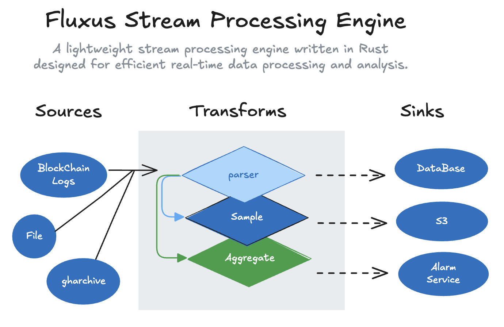

  

# Fluxus Stream Processing Engine

Fluxus is a lightweight stream processing engine written in Rust, designed for efficient real-time data processing and analysis.

## Features

- High-performance stream processing
- Flexible windowing operations (Tumbling, Sliding, Session windows)
- Parallel processing support
- Rich set of stream operations (map, filter, aggregate)
- Type-safe API
- Easy to use and extend
